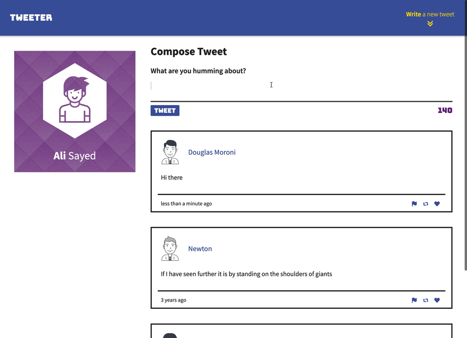
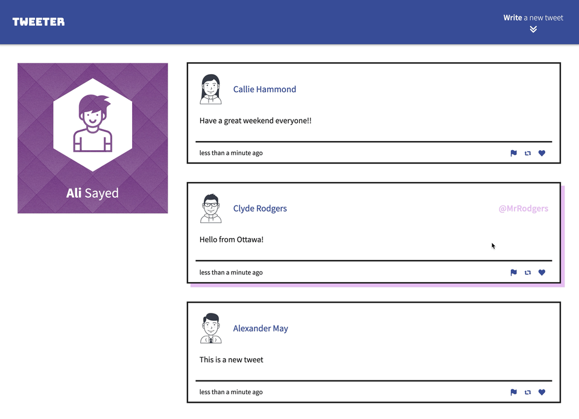
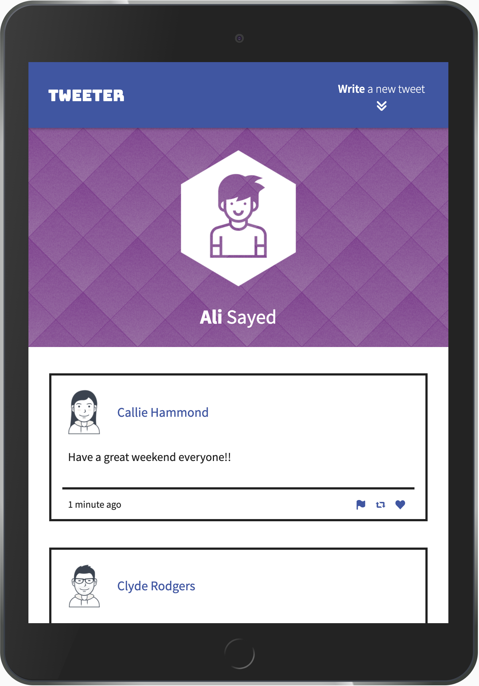
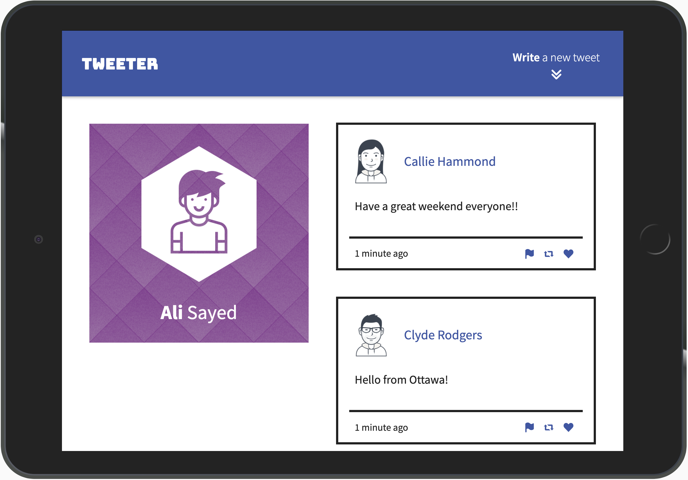

# Tweeter Project

Hello!

Tweeter is a simple, single-page [Twitter](https://twitter.com/explore) clone. It is built using **HTML**, **SCSS**, **JS**, **jQuery** and **AJAX**.

## App Preview

### New Post


---

### Validation




---

### Scroll



---

### Responsive




## Dependencies

- Node.js
- Express

A **package.json** file has been set up with all the dependencies needed for this app:

```json
{
  "name": "tweeter",
  "version": "1.0.0",
  "description": "A twitter clone",
  "main": "server/index.js",
  "scripts": {
    "test": "echo \"Error: no test specified\" && exit 1",
    "start": "node server/index.js",
    "local": "./node_modules/.bin/nodemon --watch server -e js server/index.js"
  },
  "repository": {
    "type": "git",
    "url": "git+https://github.com/aliyasser20/tweeter.git"
  },
  "author": "Ali Sayed",
  "license": "ISC",
  "dependencies": {
    "body-parser": "^1.15.2",
    "chance": "^1.0.2",
    "express": "^4.13.4",
    "md5": "^2.1.0"
  },
  "devDependencies": {
    "nodemon": "^1.9.2"
  }
}
```

## Run Locally

1. Clone git repository
2. Install all dependencies using `npm install`
3. Run the development web server using the `npm run local`

---

**Note**: This app was created for demo purposes only.
